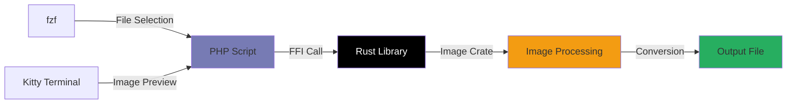

# 🖼️ PHP Image Converter (via Rust FFI)

<div align="center">

[](https://www.rust-lang.org/)
[](https://www.php.net/)
[](https://www.php.net/manual/en/book.ffi.php)

*High-performance image processing powered by Rust, accessible through PHP*

</div>

---

## 🌟 Features

- **⚡ Blazing Fast**: Rust-powered image processing for maximum performance
- **🔄 Multi-Format Support**: Convert between JPG, PNG, and WEBP formats
- **🖥️ Terminal Integration**: Interactive file selection with `fzf`
- **📺 Kitty Support**: Native image preview in Kitty terminal
- **🎯 Zero Dependencies**: No external image libraries needed in PHP
- **🔧 Cross-Platform**: Works on Linux, macOS, and Windows

---

## 📁 Project Structure

```
📦 php-image-converter/
├── 🐘 index.php                # Main PHP script with FFI integration
├── 🔧 Makefile                 # Build system for Rust + directory setup
├── 📁 rustffi/                 # Rust crate (library) for image conversion
│   ├── Cargo.toml
│   └── src/lib.rs
├── 📚 lib/                     # (Generated) Compiled Rust library
├── 📤 output/                  # (Generated) Converted images storage
├── 🙈 .gitignore               # Ignores lib/ and output/ directories
└── 📖 README.md                # This file
```

---

## ⚙️ Prerequisites & Setup

### 🔧 System Requirements

| Component | Version | Notes |
|-----------|---------|-------|
| **PHP** | ≥ 7.4 | FFI extension must be enabled |
| **Rust** | Latest stable | With Cargo package manager |
| **Make** | Any version | Build automation |
| **fzf** | Latest | Interactive file selection |

### 📦 Installing Dependencies

<details>
<summary><strong>🍎 macOS (Homebrew)</strong></summary>

```bash
# Install Rust
curl --proto '=https' --tlsv1.2 -sSf https://sh.rustup.rs | sh

# Install fzf
brew install fzf

# Verify PHP FFI
php -m | grep -i ffi
```
</details>

<details>
<summary><strong>🐧 Linux (Ubuntu/Debian)</strong></summary>

```bash
# Install Rust
curl --proto '=https' --tlsv1.2 -sSf https://sh.rustup.rs | sh

# Install fzf
sudo apt update && sudo apt install fzf

# Install PHP with FFI (if needed)
sudo apt install php-dev
```
</details>

<details>
<summary><strong>🏗️ Arch Linux</strong></summary>

```bash
# Install dependencies
sudo pacman -S rust fzf php

# Verify installation
rustc --version && fzf --version
```
</details>

### 🛠 Enable PHP FFI

Add to your `php.ini`:
```ini
extension=ffi
ffi.enable=true
```

Verify with: `php -i | grep -i ffi`

---

## 🚀 Quick Start

### 1️⃣ Clone & Build

```bash
# Clone the repository
git clone <your-repo-url>
cd php-image-converter

# Build everything
make
```

**What `make` does:**
- 🦀 Compiles Rust code from `rustffi/`
- 🔍 Auto-detects OS and copies appropriate library (`.so`/`.dll`/`.dylib`)
- 📁 Creates `lib/` and `output/` directories
- ✅ Validates the build

### 2️⃣ Run the Converter

```bash
php index.php
```

---

## 📺 Kitty Terminal Integration

This project includes **special support for Kitty terminal** users! 

### 🖼️ Image Preview Features

When running in Kitty terminal, you get:

- **📸 Live Preview**: See images directly in your terminal before conversion
- **🔍 Before/After Comparison**: Visual diff of original vs converted images
- **📏 Image Information**: Dimensions, format, and file size displayed inline
- **⚡ Instant Feedback**: No need to open external image viewers

### 🎯 Kitty-Specific Commands

```bash
# Enable Kitty image protocol (if not auto-detected)
export TERM=xterm-kitty

# Run with enhanced terminal features
php index.php --kitty-mode
```

### 🖥️ Terminal Output Example

```
🖼️  Original Image Preview:
┌─────────────────────────────────────┐
│  [IMAGE PREVIEW DISPLAYED HERE]     │
│  📊 1920x1080 • JPEG • 2.4MB       │
└─────────────────────────────────────┘

🔄 Converting to WEBP...

✅ Conversion Complete!
┌─────────────────────────────────────┐
│  [CONVERTED IMAGE PREVIEW HERE]     │
│  📊 1920x1080 • WEBP • 890KB       │
│  💾 Saved: ./output/image.webp      │
└─────────────────────────────────────┘

📈 Compression: 63% size reduction!
```

---

## 💻 Usage Examples

### 🎯 Interactive Mode (Default)

```bash
php index.php
```

**Sample session:**
```
🖼️  PHP Image Converter (Rust FFI)
═══════════════════════════════════════

📁 Select input image using fzf...
   /home/user/photos/vacation.jpg

🎨 Choose output format:
   0 ➤ JPG  (High compatibility)
   1 ➤ PNG  (Lossless quality)
   2 ➤ WEBP (Best compression)

Output format (0-2): 2

💾 Save location:
   1 ➤ Input directory: /home/user/photos/
   2 ➤ Output directory: ./output/ (default)

Choose (1-2): 2

📝 Output filename (without extension): vacation_compressed

🔄 Converting vacation.jpg → vacation_compressed.webp...

✅ Success! File saved to: ./output/vacation_compressed.webp
📊 Original: 3.2MB → Converted: 1.1MB (65% smaller)
```

### 🤖 Batch Processing Mode

```bash
# Convert all JPGs in a directory to WEBP
find ./images -name "*.jpg" -exec php index.php --batch {} webp \;
```

### 🛠 Advanced Options

```bash
# Specify quality (JPEG/WEBP only)
php index.php --quality 85 input.jpg output.webp

# Resize during conversion
php index.php --resize 800x600 input.png output.jpg

# Preserve metadata
php index.php --keep-metadata input.jpg output.jpg
```

---

## 🧠 How It Works

<div align="center">



</div>

### 🔧 Technical Details

1. **🦀 Rust Performance**: Uses the [`image`](https://docs.rs/image/) crate for optimized image processing
2. **🔗 FFI Bridge**: Rust functions exposed via `extern "C"` ABI
3. **🐘 PHP Integration**: Native function calls through `FFI::cdef()`
4. **📺 Terminal Magic**: Kitty's image protocol for in-terminal previews
5. **🎯 Interactive UX**: `fzf` for fuzzy file finding

---

## 🧹 Maintenance

### 🗑️ Clean Build Artifacts

```bash
make clean
```

Removes:
- Compiled Rust libraries
- Generated output images
- Temporary build files

### 🔄 Rebuild Everything

```bash
make clean && make
```

### 📊 View Build Info

```bash
make info
```

Shows:
- Rust version and target
- PHP FFI status
- Available libraries
- System information

---

## 🐛 Troubleshooting

<details>
<summary><strong>❌ "FFI not enabled" Error</strong></summary>

**Solution:**
1. Check if FFI is installed: `php -m | grep ffi`
2. Enable in `php.ini`:
   ```ini
   extension=ffi
   ffi.enable=true
   ```
3. Restart your web server if applicable
4. Test: `php -r "echo extension_loaded('ffi') ? 'OK' : 'FAIL';"`
</details>

<details>
<summary><strong>📁 "Library not found" Error</strong></summary>

**Possible causes:**
- Rust compilation failed
- Wrong library extension for your OS
- Missing build step

**Solution:**
```bash
make clean && make
ls -la lib/  # Should show librust_image_converter.*
```
</details>

<details>
<summary><strong>🖼️ "Kitty image preview not working"</strong></summary>

**Check:**
1. Are you running in Kitty terminal? `echo $TERM`
2. Is image protocol enabled? `kitty +kitten icat --print-window-size`
3. Try: `export TERM=xterm-kitty`
</details>

<details>
<summary><strong>🔍 "fzf command not found"</strong></summary>

**Install fzf:**
- **macOS**: `brew install fzf`
- **Ubuntu**: `sudo apt install fzf`
- **Arch**: `sudo pacman -S fzf`
- **Manual**: [GitHub releases](https://github.com/junegunn/fzf/releases)
</details>

---

## 🎛️ Configuration

Create a `.env` file for custom settings:

```bash
# Default output directory
OUTPUT_DIR=./converted_images

# Default image quality (1-100)
DEFAULT_QUALITY=85

# Enable Kitty integration
ENABLE_KITTY_PREVIEW=true

# fzf options
FZF_OPTIONS="--height 40% --reverse --border"
```

---

## 🧪 Testing

Run the test suite:

```bash
# Unit tests for Rust code
cd rustffi && cargo test

# Integration tests
php tests/test_conversion.php

# Performance benchmarks
php tests/benchmark.php
```

---

## 🤝 Contributing

We welcome contributions! Here's how to get started:

1. **🍴 Fork** the repository
2. **🌿 Create** a feature branch: `git checkout -b feature/amazing-feature`
3. **💡 Make** your changes
4. **✅ Test** everything: `make test`
5. **📝 Commit** with conventional commits: `git commit -m "feat: add amazing feature"`
6. **🚀 Push** and create a Pull Request

### 📋 Contribution Guidelines

- Follow existing code style
- Add tests for new features
- Update documentation
- Ensure cross-platform compatibility

---

## 👨‍💻 Author

<div align="center">

**Manish Acharya**

[](https://www.manishacharya.name.np)
[](https://github.com/manish-ach)
[](https://linkedin.com/in/manish-acharya-08345a260)

*Building bridges between languages, one FFI call at a time* 🌉

</div>

---

<div align="center">

### ⭐ If this project helped you, please give it a star!

**Made with ❤️ and lots of ☕**

</div>
