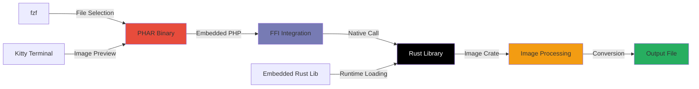

# 🖼️ PHP Image Converter (via Rust FFI)

<div align="center">

[](https://www.rust-lang.org/)
[](https://www.php.net/)
[](https://www.php.net/manual/en/book.ffi.php)

*High-performance image processing powered by Rust, accessible through PHP*

</div>

---

## 🌟 Features

- **⚡ Blazing Fast**: Rust-powered image processing for maximum performance
- **🔄 Multi-Format Support**: Convert between JPG, PNG, and WEBP formats
- **🖥️ Terminal Integration**: Interactive file selection with `fzf`
- **📺 Kitty Support**: Native image preview in Kitty terminal
- **🎯 Zero Dependencies**: No external image libraries needed in PHP
- **🔧 Cross-Platform**: Works on Linux, macOS, and Windows
- **📦 Portable Binary**: Standalone executable with embedded dependencies

---

## 📁 Project Structure

```
📦 php-image-converter/
├── 🐘 index.php                # Main PHP script with FFI integration
├── 🔧 Makefile                 # Build system for Rust + binary creation
├── 🏗️ build-phar.php           # PHAR builder script
├── 📁 rustffi/                 # Rust crate (library) for image conversion
│   ├── Cargo.toml
│   └── src/lib.rs
├── 📚 lib/                     # (Generated) Compiled Rust library
├── 📤 output/                  # (Generated) Converted images storage
├── 📦 app.phar                 # (Generated) Portable executable
├── 🔗 image-converter          # (Generated) Symlink to app.phar
├── 🙈 .gitignore               # Ignores generated files
└── 📖 README.md                # This file
```

---

## ⚙️ Prerequisites & Setup

### 🔧 System Requirements

| Component | Version | Notes |
|-----------|---------|-------|
| **PHP** | ≥ 7.4 | FFI extension must be enabled |
| **Rust** | Latest stable | With Cargo package manager |
| **Make** | Any version | Build automation |
| **fzf** | Latest | Interactive file selection |

### 📦 Installing Dependencies

<details>
<summary><strong>🍎 macOS (Homebrew)</strong></summary>

```bash
# Install Rust
curl --proto '=https' --tlsv1.2 -sSf https://sh.rustup.rs | sh

# Install fzf
brew install fzf

# Verify PHP FFI
php -m | grep -i ffi
```
</details>

<details>
<summary><strong>🐧 Linux (Ubuntu/Debian)</strong></summary>

```bash
# Install Rust
curl --proto '=https' --tlsv1.2 -sSf https://sh.rustup.rs | sh

# Install fzf
sudo apt update && sudo apt install fzf

# Install PHP with FFI (if needed)
sudo apt install php-dev
```
</details>

<details>
<summary><strong>🏗️ Arch Linux</strong></summary>

```bash
# Install dependencies
sudo pacman -S rust fzf php

# Verify installation
rustc --version && fzf --version
```
</details>

### 🛠 Enable PHP FFI

Add to your `php.ini`:
```ini
extension=ffi
ffi.enable=true
```

Verify with: `php -i | grep -i ffi`

---

## 🚀 Quick Start

### 1️⃣ Clone & Build

```bash
# Clone the repository
git clone https://github.com/manish-ach/image-converter.git
cd image-converter

# Build everything (creates portable binary)
make
```

**What `make` does:**
- 🦀 Compiles Rust code from `rustffi/`
- 🔍 Auto-detects OS and copies appropriate library (`.so`/`.dll`/`.dylib`)
- 📁 Creates `lib/` and `output/` directories
- 📦 Builds portable PHAR executable
- 🔗 Creates `image-converter` symlink
- ✅ Makes all executables properly accessible

### 2️⃣ Run the Converter

**Option 1: Using the portable binary**
```bash
./image-converter
```

**Option 2: Direct PHP execution**
```bash
php index.php
```

**Option 3: Using PHAR directly**
```bash
./app.phar
```

### 3️⃣ Global Installation (Optional)

```bash
# Copy to system PATH for global access
sudo cp image-converter /usr/local/bin/
sudo cp app.phar /usr/local/bin/

# Now use from anywhere
image-converter
```

---

## 📺 Kitty Terminal Integration

This project includes **special support for Kitty terminal** users! 

### 🖼️ Image Preview Features

When running in Kitty terminal, you get:

- **📸 Live Preview**: See images directly in your terminal before conversion
- **🔍 Before/After Comparison**: Visual diff of original vs converted images
- **📏 Image Information**: Dimensions, format, and file size displayed inline
- **⚡ Instant Feedback**: No need to open external image viewers

### 🎯 Kitty-Specific Commands

```bash
# Enable Kitty image protocol (if not auto-detected)
export TERM=xterm-kitty

# Run with enhanced terminal features
./image-converter --kitty-mode
```

### 🖥️ Terminal Output Example

<details>
   <summary><strong>Screenshots</strong></summary>
   
   
   
   
   
   

   
 
</details>

---

## 💻 Usage Examples

### 🎯 Interactive Mode (Default)

```bash
./image-converter
```

**Sample session:**
```
🖼️  PHP Image Converter (Rust FFI)
═══════════════════════════════════════

📁 Select input image using fzf...
   /home/user/photos/vacation.jpg

🎨 Choose output format:
   0 ➤ JPG  (High compatibility)
   1 ➤ PNG  (Lossless quality)
   2 ➤ WEBP (Best compression)

Output format (0-2): 2

💾 Save location:
   1 ➤ Input directory: /home/user/photos/
   2 ➤ Output directory: ./output/ (default)

Choose (1-2): 2

📝 Output filename (without extension): vacation_compressed

🔄 Converting vacation.jpg → vacation_compressed.webp...

✅ Success! File saved to: ./output/vacation_compressed.webp
📊 Original: 3.2MB → Converted: 1.1MB (65% smaller)
```

<details>
<summary><strong>Planned Features</strong></summary>
   
### 🤖 Batch Processing Mode

```bash
# Convert all JPGs in a directory to WEBP
find ./images -name "*.jpg" -exec ./image-converter --batch {} webp \;
```

### 🛠 Advanced Options

```bash
# Specify quality (JPEG/WEBP only)
./image-converter --quality 85 input.jpg output.webp

# Resize during conversion
./image-converter --resize 800x600 input.png output.jpg

# Preserve metadata
./image-converter --keep-metadata input.jpg output.jpg
```

</details>

---

## 🧠 How It Works

<div align="center">



</div>

### 🔧 Technical Details

1. **📦 PHAR Packaging**: Everything bundled into a single executable file
2. **🦀 Rust Performance**: Uses the [`image`](https://docs.rs/image/) crate for optimized image processing
3. **🔗 FFI Bridge**: Rust functions exposed via `extern "C"` ABI
4. **🐘 PHP Integration**: Native function calls through `FFI::cdef()`
5. **📺 Terminal Magic**: Kitty's image protocol for in-terminal previews
6. **🎯 Interactive UX**: `fzf` for fuzzy file finding
7. **🚀 Portable Execution**: No installation required, runs anywhere

---

## 🏗️ Build System

### 📊 Build Targets

```bash
make help
```

Available commands:
- `make` or `make all` - Build everything (default)
- `make rust-lib` - Build only the Rust library
- `make binary` - Create PHAR binary and symlink
- `make clean` - Clean all build artifacts
- `make help` - Show available commands

### 🔧 What Gets Built

The build process creates:
- **📚 `lib/librust_image_converter.*`** - Compiled Rust library
- **📦 `app.phar`** - Portable PHP executable (chmod +x)
- **🔗 `image-converter`** - Convenient symlink (chmod +x)
- **📁 `output/`** - Directory for converted images

---

## 🧹 Maintenance

### 🗑️ Clean Build Artifacts

```bash
make clean
```

Removes:
- Compiled Rust libraries (`lib/`)
- Generated output images (`output/`)
- PHAR executable (`app.phar`)
- Symlink (`image-converter`)
- Temporary build files

### 🔄 Rebuild Everything

```bash
make clean && make
```

### 📋 Development Workflow

```bash
# 1. Make changes to source code
vim index.php rustffi/src/lib.rs

# 2. Rebuild
make

# 3. Test the binary
./image-converter

# 4. Clean when done
make clean
```

---

## 🐛 Troubleshooting

<details>
<summary><strong>❌ "FFI not enabled" Error</strong></summary>

**Solution:**
1. Check if FFI is installed: `php -m | grep ffi`
2. Enable in `php.ini`:
   ```ini
   extension=ffi
   ffi.enable=true
   ```
3. Restart your web server if applicable
4. Test: `php -r "echo extension_loaded('ffi') ? 'OK' : 'FAIL';"`
</details>

<details>
<summary><strong>📁 "Library not found" Error</strong></summary>

**Possible causes:**
- Rust compilation failed
- Wrong library extension for your OS
- Missing build step

**Solution:**
```bash
make clean && make
ls -la lib/  # Should show librust_image_converter.*
ls -la app.phar image-converter # Should be executable
```
</details>

<details>
<summary><strong>🔐 "Permission denied" when running binary</strong></summary>

**Solution:**
```bash
# Make sure files are executable
chmod +x app.phar image-converter

# Or rebuild (Makefile handles this automatically)
make clean && make
```
</details>

<details>
<summary><strong>🖼️ "Kitty image preview not working"</strong></summary>

**Check:**
1. Are you running in Kitty terminal? `echo $TERM`
2. Is image protocol enabled? `kitty +kitten icat --print-window-size`
3. Try: `export TERM=xterm-kitty`
</details>

<details>
<summary><strong>🔍 "fzf command not found"</strong></summary>

**Install fzf:**
- **macOS**: `brew install fzf`
- **Ubuntu**: `sudo apt install fzf`
- **Arch**: `sudo pacman -S fzf`
- **Manual**: [GitHub releases](https://github.com/junegunn/fzf/releases)
</details>

<details>
<summary><strong>📦 "PHAR creation failed"</strong></summary>

**Check:**
1. PHP PHAR extension enabled: `php -m | grep -i phar`
2. PHAR readonly setting: `php -i | grep phar.readonly`
3. If readonly=On, the Makefile uses `-d phar.readonly=0` to override

**Manual fix:**
```bash
php -d phar.readonly=0 build-phar.php
```
</details>

---

## 🚀 Deployment

### 📦 Distributing Your Binary

The built `app.phar` and `image-converter` files are completely portable:

```bash
# Package for distribution
tar -czf image-converter-release.tar.gz app.phar image-converter README.md

# Or just copy the files
cp app.phar image-converter /path/to/deployment/
```

### 🌐 System-wide Installation

```bash
# Install globally
sudo cp image-converter /usr/local/bin/
sudo cp app.phar /usr/local/bin/

# Verify installation
which image-converter
image-converter --version
```

### 🐳 Docker Usage

```dockerfile
FROM php:8.1-cli

# Install FFI extension
RUN docker-php-ext-install ffi

# Copy your built binary
COPY app.phar /usr/local/bin/image-converter
RUN chmod +x /usr/local/bin/image-converter

ENTRYPOINT ["image-converter"]
```

---

## 🤝 Contributing

We welcome contributions! Here's how to get started:

1. **🍴 Fork** the repository
2. **🌿 Create** a feature branch: `git checkout -b feature/amazing-feature`
3. **💡 Make** your changes
4. **🏗️ Test** the build: `make clean && make`
5. **✅ Test** functionality: `./image-converter`
6. **📝 Commit** with conventional commits: `git commit -m "feat: add amazing feature"`
7. **🚀 Push** and create a Pull Request

### 📋 Contribution Guidelines

- Follow existing code style
- Test both direct PHP and PHAR execution
- Update documentation for new features
- Ensure cross-platform compatibility
- Test the build system changes

---

## 📈 Performance Notes

### ⚡ Speed Comparisons

The Rust FFI approach provides significant performance benefits:

- **🐘 Pure PHP**: ~2-3 seconds for 5MB image
- **🦀 Rust FFI**: ~0.3-0.5 seconds for 5MB image
- **📦 PHAR overhead**: Minimal (~0.01s startup time)

### 💾 Memory Usage

- **Rust library**: Efficient memory management
- **PHAR execution**: Standard PHP memory usage
- **No memory leaks**: FFI calls properly managed

---

## 👨‍💻 Author

<div align="center">

**Manish Acharya**

[](https://www.manishacharya.name.np)
[](https://github.com/manish-ach)
[](https://linkedin.com/in/manish-acharya-08345a260)

*Building bridges between languages, one FFI call at a time* 🌉

</div>

---

## 🙏 Special Thanks

**Sameepkat** - For invaluable help and support throughout the development process

---

<div align="center">

### ⭐ If this project helped you, please give it a star!

**Made with ❤️ and lots of ☕**

*Now with portable binary goodness!* 📦✨

</div>
